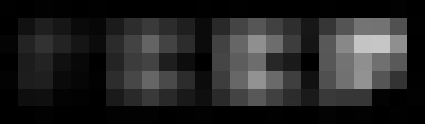
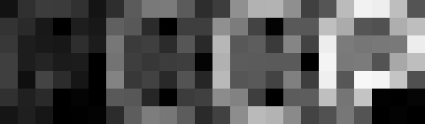
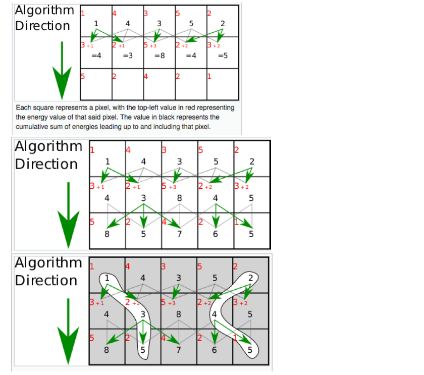

# ImageEditor
## Part 1
## Aim
Design a simple image editor which performs a few basic tasks on an input image. The particular tasks are averaging and performing edge detection of an image. Image files provided in pgm (portable graymap format). Also, implementing an algorithm that finds a path from top of the image to the bottom, which has the least energy.

### **Averaging Filter**
Create an image of the size W*H using an array of integers.
W: width of test image
H: height of test image

Pixel value at location (i,j) of the image equals the average of the pixel values at locations (i − 1, j − 1), (i − 1, j), (i − 1, j + 1),(i,j−1),(i,j),(i,j+1),(i+1,j−1),(i+1,j),(i+1,j+1) of the input image.

**Input**

**Output**

### **Edge Detection**
The idea here is to compute some function of pixel values among neighbouring cells in horizontal and vertical directions. This function approximates how close these pixel values are relative to each other. If pixel values in a neighbourhood are similar, then this function value would be very small or 0 where as if there is a significant change in neighbourhood pixel values, then this function would have non-zero values.

**Input**

**Output**

### **Path of least Energy**

In this part, aim is to find the path of least energy.

*Pictorial view of the computation*

Algorithm:

Dynamic Programming Approach (Breadth First Search or Depth First Search):

Create an array of the co-ordinates of the minimum elements in the last row. Now pop out an element from the array and find the co-ordinates of the minimum element from the row just above the last row. Append the co-ordinates to the array. Continue the process recursively to reach the top row.

The array obtained thus contains all the co-ordinates of the image which define the path of lowest energy.

**Input**

**Output**

